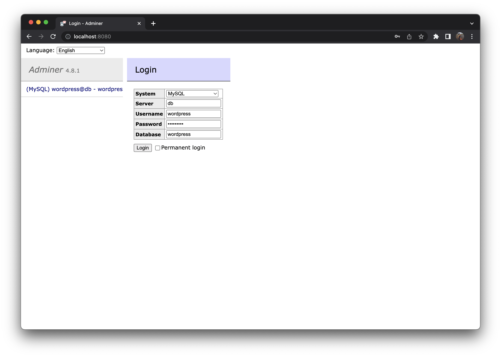
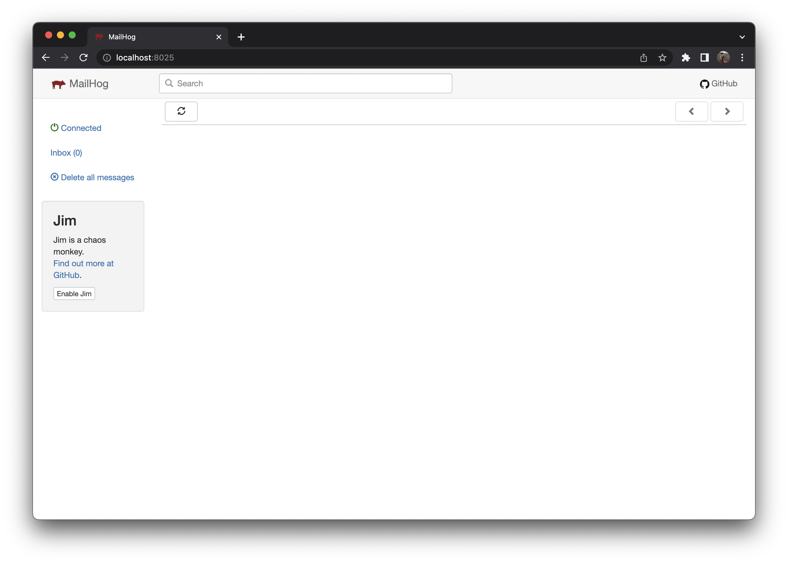

# WPClothes2Order testing environment

If you want to test the [WPClothes2Order](https://github.com/AshleyRedman/WPClothes2Order) plugin in isolation easily, use this package.

## Assumptions

-   This guide is for MacOS & Linux users, I currently do not use a windows machine, so a PR on this README on how to get started with a windows setup would be appreciated.

- We assume you have [composer](https://getcomposer.org/doc/00-intro.md) installed.

## Getting started

```bash
~/$ git clone git@github.com:AshleyRedman/WPClothes2Order-test-env.git
~/$ cd WPClothes2Order-test-env
~/WPClothes2Order-test-env$ sh quickstart.sh
```

This will setup a dockerized WordPress env on `http://localhost:8000` and clone down the WPClothes2Order plugin on the dev branch ready to go.
See the `quickstart.sh` for more detail.

Once setup, you will need to install the packages for the `WPClothes2Order` plugin.

```bash
~/WPClothes2Order-test-env/app/wp-content/plugins/WPClothes2Order$ composer install
```

## Development

This environment is simply just for development/testing. Once you have completed the above steps, navigate to `cd app/wp-content/plugins/WPClothes2Order` and start.
As this is a sub git directory, the plugin files are what can be checked in and submit for PR.

You can login to the dashboard, via url `http://localhost:8000/wp-login.php`,

```
Username: admin
Password: password
```

You can view the database using [adminer](https://www.adminer.org/), via url `http://localhost:8080`.



```
System: MySQL
Server: db
Username: wordpress
Password: wordpress
Database: wordpress
```

This application uses [mailhog](https://github.com/mailhog/MailHog) as am email client, running on port `1025`. The UI for this can be accessed via `http://localhost:8025`.



If you spot a bug with this setup or have any questions, please open an [issue](https://github.com/AshleyRedman/WPClothes2Order-test-env/issues).
